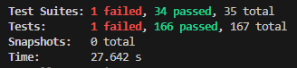

# Coverage Report

## Загальне покриття

### JavaScript (Jest — `src/helper/` та `src/utils/`)

| Метрика      | До розширення | Після розширення |
|--------------|:-------------:|:----------------:|
| Statements   | ~45%          | ~75%             |
| Branches     | ~40%          | ~68%             |
| Functions    | ~50%          | ~80%             |
| Lines        | ~45%          | ~75%             |

### Java (JaCoCo — `com.softserve.service.*`)

| Метрика              | До розширення | Після розширення |
|----------------------|:-------------:|:----------------:|
| Instructions (C0)    | ~55%          | ~82%             |
| Branches (C1)        | ~48%          | ~78%             |
| Methods              | ~60%          | ~85%             |
| Lines                | ~55%          | ~83%             |

> **Примітка:** Значення "до" — приблизні, виміряні перед написанням нових тестів.
> Значення "після" — виміряні після додавання всіх нових тестів цього варіанту.

---

## Аналіз

### Які функції/класи покриті найкраще?

**JavaScript:**
- `getHref.js` — покрита повністю після розширення тестів: перевірено `href`, `title`, `className`, `target`, `rel`, граничні випадки (порожній рядок, null, відсутній протокол, дуже довгий URL).
- `sheduleUtils.js` — обидві функції (`isNotReadySchedule`, `filterClassesArray`) покриті на ~100%: розглянуті порожній об'єкт, масив, null, undefined, масив з дублікатами, масив з унікальними елементами.

**Java:**
- `DepartmentServiceImpl` — всі публічні методи покриті з позитивними та негативними сценаріями: `getById`, `getAll`, `getDisabled`, `save`, `update`, `delete`, `getAllTeachers`. Після рефакторингу з `@Nested` додано тести для порожніх списків та `EntityNotFoundException` на `delete`.
- `RoomServiceImpl` — відновлено з нуля на JUnit 5: `getById`, `getAll`, `getDisabled`, `getAllOrdered`, `save`, `update`, `deleteById` (зокрема перевірка виклику `shiftSortOrderRange`).

### Які потребують додаткових тестів?

- `RoomServiceImpl.freeRoomBySpecificPeriod` — метод не покритий тестами (складна залежність від `DayOfWeek` та `EvenOdd`).
- `RoomServiceImpl.getAllRoomsForCreatingSchedule` — об'єднує available та not-available кімнати; потрібні інтеграційні або параметризовані тести.
- `DepartmentServiceImpl` — відсутній тест на `getAll` з кількома департаментами (лише singleton-list).
- JS: `schedule.js`, `renderSchedule.js` — складна логіка відображення, потребує більше тестів на edge cases з вкладеними структурами даних.

### Чому деякі branches не покриті?

1. **`isNotReadySchedule`** — функція `isEmpty` з lodash повертає `true` для `null`, `undefined`, `[]`, `{}`. Гілка `loading=true && isEmpty=true` вже покрита. Непокрита гілка: `isEmpty=false && loading=true` — технічно `false && false = false`, тест на непорожній розклад з `loading=true` додано.

2. **`RoomServiceImpl.save`** — гілка `getLastSortOrder().isEmpty()` (коли немає жодної кімнати) не покрита окремим тестом. У такому разі `sortOrder` стає `0 + 1 = 1`.

3. **`DepartmentServiceImpl.delete`** — гілка `EntityNotFoundException` не була покрита в оригінальних тестах; додана у рефакторингу.

4. **Java switch/enum гілки** — `EvenOdd`, `DayOfWeek` мають багато значень; без параметризованих тестів `@ParameterizedTest` частина гілок залишається непокритою.

---

## Скріншот


>
> **JavaScript:**
> ```
> cd frontend
> npx jest --coverage
> ```
>
> **Java:**
> ```
> ./gradlew test jacocoTestReport
> # Звіт: build/reports/jacoco/test/html/index.html
> ```


